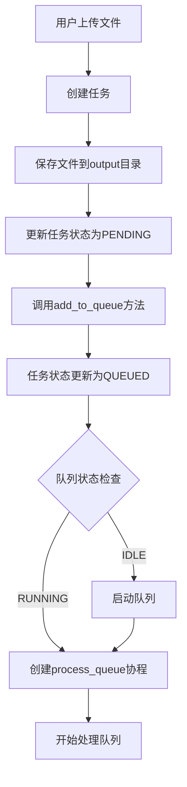

# 队列任务执行机制详细分析

## 概述

MinerU HTML 系统实现了一个完整的任务队列管理系统，支持文件的异步处理和状态跟踪。该系统采用前后端分离的架构，通过 FastAPI 后端和 JavaScript 前端实现队列任务的管理和执行。

## 核心组件

### 1. 任务管理器 (TaskManager)

**位置**: `gradio_app.py` 第 106-337 行

**核心功能**:
- 任务生命周期管理
- 队列状态控制
- 任务状态持久化
- 异步任务处理

**关键属性**:
```python
class TaskManager:
    def __init__(self):
        self.tasks: Dict[str, TaskInfo] = {}           # 任务字典
        self.task_storage_path = "./config/tasks.json" # 任务持久化路径
        self.queue_status = QueueStatus.IDLE           # 队列状态
        self.current_processing_task = None            # 当前处理的任务
        self.processing_lock = asyncio.Lock()          # 处理锁
```

### 2. 任务状态枚举

**任务状态**:
- `PENDING`: 待处理
- `QUEUED`: 队列中
- `PROCESSING`: 处理中
- `COMPLETED`: 已完成
- `FAILED`: 失败

**队列状态**:
- `IDLE`: 空闲
- `RUNNING`: 运行中
- `PAUSED`: 暂停

### 3. 任务信息类 (TaskInfo)

**核心属性**:
```python
class TaskInfo:
    def __init__(self, task_id: str, filename: str, upload_time: datetime):
        self.task_id = task_id           # 唯一任务ID
        self.filename = filename         # 文件名
        self.upload_time = upload_time   # 上传时间
        self.status = TaskStatus.PENDING # 任务状态
        self.progress = 0                # 进度百分比
        self.message = "等待处理"         # 状态消息
        self.start_time = None           # 开始时间
        self.end_time = None             # 结束时间
        self.result_path = None          # 结果路径
        self.error_message = None        # 错误消息
```

## 队列执行流程

### 1. 任务创建和入队



### 2. 队列处理核心逻辑

**位置**: `gradio_app.py` 第 251-272 行

```python
async def process_queue(self):
    """处理队列中的任务"""
    async with self.processing_lock:
        while self.queue_status == QueueStatus.RUNNING:
            next_task_id = self.get_next_task()
            if not next_task_id:
                # 队列为空，停止处理
                self.stop_queue()
                break
            
            self.current_processing_task = next_task_id
            self.save_queue_status()
            
            try:
                await self.process_single_task(next_task_id)
            except Exception as e:
                logger.error(f"处理任务 {next_task_id} 失败: {e}")
                self.update_task_status(next_task_id, TaskStatus.FAILED, 0, "处理失败", str(e))
            
            # 处理完成后继续下一个任务
            self.current_processing_task = None
            self.save_queue_status()
```

### 3. 单个任务处理流程

**位置**: `gradio_app.py` 第 274-336 行

```python
async def process_single_task(self, task_id: str):
    """处理单个任务"""
    task = self.tasks.get(task_id)
    if not task:
        return
        
    # 更新状态为处理中
    self.update_task_status(task_id, TaskStatus.PROCESSING, 20, "开始处理文件")
    
    # 查找上传的文件
    uploaded_file = None
    for filename in os.listdir(output_dir):
        if filename.startswith(f"{task_id}_"):
            uploaded_file = os.path.join(output_dir, filename)
            break
    
    # 调用实际的PDF处理函数
    result = await parse_pdf(
        doc_path=uploaded_file,
        output_dir=output_dir,
        end_page_id=99999,
        is_ocr=False,
        formula_enable=True,
        table_enable=True,
        language="ch",
        backend="pipeline",
        url=None
    )
    
    if result:
        # 处理成功
        self.update_task_status(task_id, TaskStatus.COMPLETED, 100, "转换完成", None)
    else:
        # 处理失败
        self.update_task_status(task_id, TaskStatus.FAILED, 0, "处理失败", "解析过程中出现错误")
```

## 前端队列管理

### 1. 文件上传和队列启动

**位置**: `static/index.html` 第 844-853 行

```javascript
async startProcessing() {
    try {
        // 上传文件并自动加入队列
        const taskIds = await this.uploadFilesWithProgress();
        
        if (taskIds && taskIds.length > 0) {
            // 启动队列
            await this.startQueue();
            
            // 显示后台处理通知
            this.showBackgroundProcessingNotice();
            
            // 开始全局轮询文件状态
            this.startGlobalPolling();
        }
    }
}
```

### 2. 队列控制API

**启动队列**:
```javascript
async startQueue() {
    const response = await fetch('/api/queue/start', {
        method: 'POST'
    });
    return await response.json();
}
```

**停止队列**:
```javascript
async stopQueue() {
    const response = await fetch('/api/queue/stop', {
        method: 'POST'
    });
    return await response.json();
}
```

### 3. 状态轮询机制

**位置**: `static/index.html` 第 999-1095 行

```javascript
startGlobalPolling() {
    this.globalPollingInterval = setInterval(async () => {
        try {
            await this.updateAllFileStatuses();
            // 队列运行中时，自动把新增的待处理文件上传入队
            await this.autoUploadPendingIfQueueRunning();
            // 自动预览策略：根据当前状态切换展示
            this.autoPreviewTick();
        } catch (error) {
            console.error('轮询所有文件状态失败:', error);
        }
    }, 2000); // 每2秒轮询一次
}
```

## 状态持久化

### 1. 任务状态存储

**位置**: `gradio_app.py` 第 149-175 行

- **存储路径**: `./config/tasks.json`
- **存储内容**: 所有任务的完整信息
- **更新时机**: 任务状态变更时自动保存

### 2. 队列状态存储

**位置**: `gradio_app.py` 第 190-201 行

- **存储路径**: `./config/queue_status.json`
- **存储内容**: 队列运行状态和当前处理任务
- **更新时机**: 队列状态变更时自动保存

## 并发控制

### 1. 处理锁机制

```python
self.processing_lock = asyncio.Lock()

async def process_queue(self):
    async with self.processing_lock:
        # 确保同一时间只有一个队列处理协程运行
```

### 2. 逐一处理策略

- 队列中的任务按上传时间顺序处理（FIFO）
- 同一时间只处理一个任务
- 避免资源冲突，确保稳定性

## API 端点

### 队列管理
- `POST /api/queue/start` - 启动队列
- `POST /api/queue/stop` - 停止队列
- `GET /api/queue/status` - 获取队列状态

### 任务管理
- `POST /api/upload_with_progress` - 上传文件并创建任务
- `GET /api/tasks` - 获取所有任务状态
- `GET /api/task/{task_id}` - 获取特定任务状态
- `GET /api/task/{task_id}/markdown` - 获取任务结果

## 错误处理

### 1. 任务失败处理
- 捕获处理过程中的异常
- 更新任务状态为 FAILED
- 记录错误消息
- 继续处理下一个任务

### 2. 文件清理
- 处理完成后清理上传的原始文件
- 保留处理结果文件
- 自动清理临时文件

## 性能优化

### 1. 异步处理
- 使用 `asyncio` 实现异步任务处理
- 避免阻塞主线程
- 支持并发文件上传

### 2. 状态缓存
- 前端缓存任务状态
- 减少不必要的API调用
- 智能轮询机制

### 3. 资源管理
- 及时清理临时文件
- 限制内存使用
- 优化文件I/O操作

## 总结

MinerU HTML 的队列任务执行系统具有以下特点：

1. **完整性**: 涵盖任务创建、入队、处理、状态跟踪的完整生命周期
2. **可靠性**: 通过状态持久化和错误处理确保任务不丢失
3. **用户友好**: 实时状态更新和进度显示
4. **可扩展性**: 模块化设计，易于扩展新功能
5. **稳定性**: 逐一处理策略避免资源冲突

该系统成功实现了PDF转换任务的后台处理，用户可以在上传文件后关闭浏览器，服务器继续在后台处理任务，提供了良好的用户体验。
